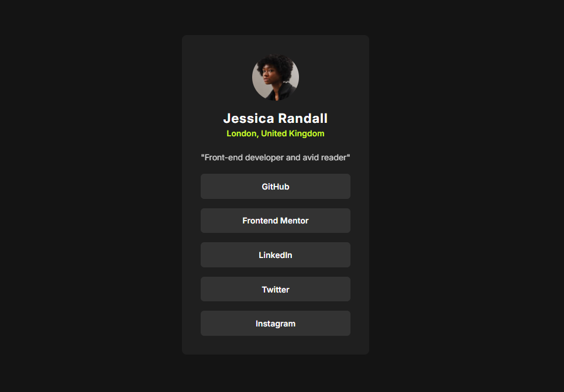

# Frontend Mentor - Social links profile solution

This is a solution to the [Social links profile challenge on Frontend Mentor](https://www.frontendmentor.io/challenges/social-links-profile-UG32l9m6dQ).

## Table of contents

- [Overview](#overview)
  - [Screenshot](#screenshot)
  - [Links](#links)
- [My process](#my-process)
  - [Built with](#built-with)
  - [Useful resources](#useful-resources)
- [Author](#author)

## Overview

### Screenshot

### Links

- Solution URL: [Github](https://github.com/Hicham-BC/social-links-profile-main)
- Live Site URL: [Social links profile](https://hicham-bc.github.io/social-links-profile-main/)

## My process

### Built with

- Semantic HTML5 markup
- CSS custom properties
- Flexbox

### Useful resources

- [opacity-css | MDN](https://developer.mozilla.org/en-US/docs/Web/CSS/Reference/Properties/opacity) - At first this helped me control the color transperency of the profile bio but because it affects the entirety of the element, I ended up prefering to use rbga() instead of it. 

## Author

- GitHub - [@Hicham-BC](https://github.com/Hicham-BC)
- Frontend Mentor - [@Hicham-BC](https://www.frontendmentor.io/profile/Hicham-BC)